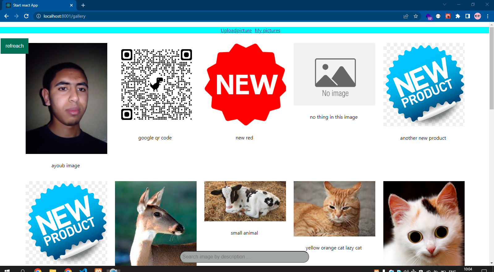
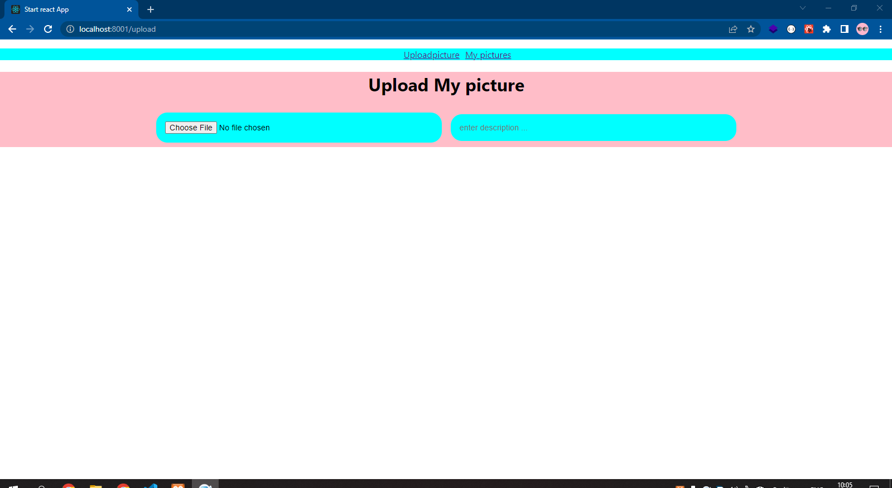
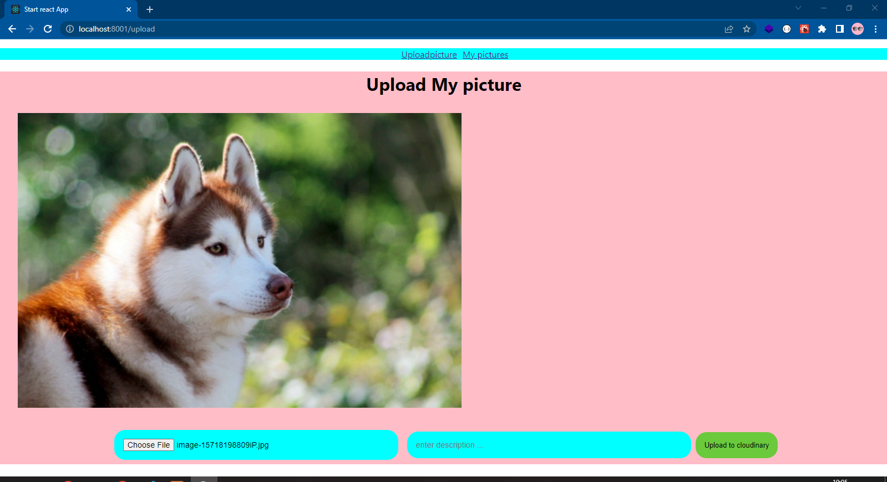
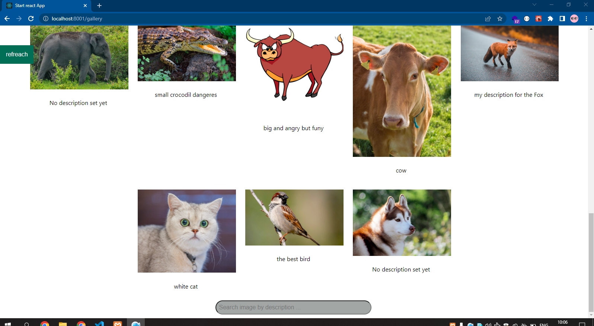
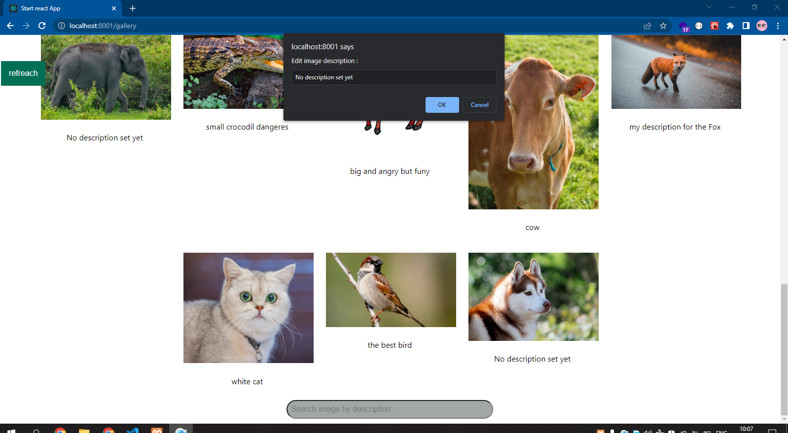
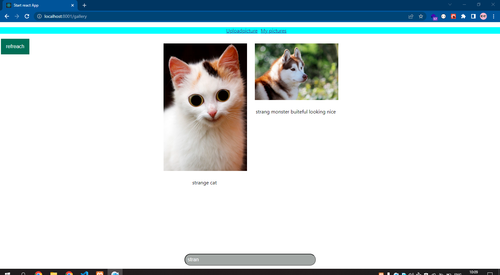

In the project directory, you can run:

### `npm start`

Runs the app in the development mode.\
Open [http://localhost:3000](http://localhost:3000) to view it in your browser.

The page will reload when you make changes.\
You may also see any lint errors in the console.

## To test this code do :
# you should first create database using the .env file to but the DATABASE_URL for prisma

## SCreenshots:

